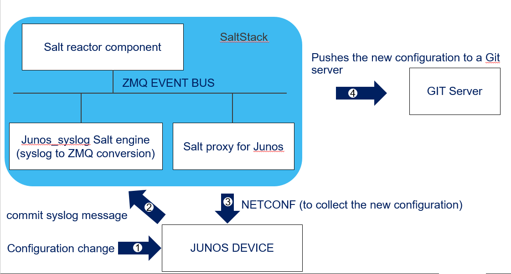

# Documentation structure

[Project description](#project-description)  
[Lab description](#lab-description)  
[About the demo](#about-the-demo)    
&nbsp;&nbsp;&nbsp;&nbsp;[Overview](#overview)  
&nbsp;&nbsp;&nbsp;&nbsp;[Details](#details)  
&nbsp;&nbsp;&nbsp;&nbsp;[Building blocks description](#building-blocks-description)    
[Instructions to prepare the setup](#instructions-to-prepare-the-setup)  
&nbsp;&nbsp;&nbsp;&nbsp;[Overview](##overview-1)  
&nbsp;&nbsp;&nbsp;&nbsp;[Clone this repository](#clone-this-repository)  
&nbsp;&nbsp;&nbsp;&nbsp;[Install Docker](#install-docker)  
&nbsp;&nbsp;&nbsp;&nbsp;[Instanciate a Gitlab docker container](#instanciate-a-gitlab-docker-container)  
&nbsp;&nbsp;&nbsp;&nbsp;[Configure Gitlab](#configure-gitlab)  
&nbsp;&nbsp;&nbsp;&nbsp;[Install SaltStack](#install-saltstack)  
&nbsp;&nbsp;&nbsp;&nbsp;&nbsp;&nbsp;&nbsp;&nbsp;[Overview](#overview-2)  
&nbsp;&nbsp;&nbsp;&nbsp;&nbsp;&nbsp;&nbsp;&nbsp;[Install master](#install-master)   
&nbsp;&nbsp;&nbsp;&nbsp;&nbsp;&nbsp;&nbsp;&nbsp;[Install Minion](#install-minion)   
&nbsp;&nbsp;&nbsp;&nbsp;&nbsp;&nbsp;&nbsp;&nbsp;[Install requirements for SaltStack Junos proxy](#install-requirements-for-saltstack-junos-proxy)  
&nbsp;&nbsp;&nbsp;&nbsp;&nbsp;&nbsp;&nbsp;&nbsp;[Install the junos syslog engine dependencies](#install-the-junos-syslog-engine-dependencies)  
&nbsp;&nbsp;&nbsp;&nbsp;[Configure your setup](#configure-your-setup)  
&nbsp;&nbsp;&nbsp;&nbsp;&nbsp;&nbsp;&nbsp;&nbsp;[Overview](#overview-3)  
&nbsp;&nbsp;&nbsp;&nbsp;&nbsp;&nbsp;&nbsp;&nbsp;[Configure SaltStack master](#configure-saltstack-master)  
&nbsp;&nbsp;&nbsp;&nbsp;&nbsp;&nbsp;&nbsp;&nbsp;[Configure SaltStack minion](#configure-saltstack-minion)  
&nbsp;&nbsp;&nbsp;&nbsp;&nbsp;&nbsp;&nbsp;&nbsp;[Configure SaltStack pillars](#configure-saltstack-pillars)  
&nbsp;&nbsp;&nbsp;&nbsp;&nbsp;&nbsp;&nbsp;&nbsp;[Configure SaltStack proxy](#configure-saltstack-proxy)  
&nbsp;&nbsp;&nbsp;&nbsp;&nbsp;&nbsp;&nbsp;&nbsp;[Configure SaltStack files server](#configure-saltstack-files-server)  
&nbsp;&nbsp;&nbsp;&nbsp;&nbsp;&nbsp;&nbsp;&nbsp;[Configure SaltStack junos syslog engine](#configure-saltstack-junos-syslog-engine)  
&nbsp;&nbsp;&nbsp;&nbsp;&nbsp;&nbsp;&nbsp;&nbsp;[Configure SaltStack reactor](#configure-saltstack-reactor)  
&nbsp;&nbsp;&nbsp;&nbsp;&nbsp;&nbsp;&nbsp;&nbsp;[Configure Junos devices to send commit messages to salt master](#configure-junos-devices-to-send-commit-messages-to-salt-master)  
[Familiarize yourself with this setup](#familiarize-yourself-with-this-setup)  
[Run the demo](#run-the-demo)  

# Project description

At each junos commit, SaltStack automatically collects the new junos configuration file and archives it to a git server  

This is a relatively simple demo. For a more advanced, robust, scalable, distributed and automated equivalent demo, please visit the repository https://github.com/ksator/automation_summit_Q3_2018  

# Lab description

Building blocks:  
- Junos (one vMX)
- Ubuntu (one host) with: 
    - SaltStack
    - Docker
    - Gitlab  
    

| hostname  | Management IP address  | Management interface  | Operating system | Version  | 
| ------------- | ------------- | ------------- | ------------- | ------------- |
| ubuntu | 100.123.35.1  | eth0  | ubuntu  | 16.04  |
| vMX-1 | 100.123.1.1 | me0  | Junos  | 17.4R1-S2.2  | 

# About the demo 

## Overview 

At each junos commit, SaltStack automatically collects the new junos configuration file and archives it to a git server: 
- When a Junos commit is completed, the Junos device send a syslog message ```UI_COMMIT_COMPLETED```.  
- The junos device is configured to send this syslog message to SaltStack.  
- Each time SaltStack receives this syslog message, SaltStack automatically collects the new junos configuration file from the Junos device that sent this commit syslog message, and SaltStack automatically archives the new Junos configuration file to a git server  

  

## Details 

Here's a more detailled description of this [demo](Automated_Junos_configuration_backup.pdf) 

## Building blocks description

### Junos
- There is one single Junos device
- The hostname is ```vMX-1```
- It is configured to send the syslog message ```UI_COMMIT_COMPLETED``` to SaltStack when a commit is completed

### SaltStack
- This demo uses these SaltStack components: A master, a minion, a proxy, the junos_syslog engine.  
- All in one SaltStack setup: all the above components runs on the same Ubuntu host.  
- The Salt master listens to syslog messages sent by junos devices
- The Salt master generates a ZMQ messages to the event bus when a junos syslog message is received. The ZMQ message has a tag and data. The data structure is a dictionary, which contains information about the event.
- The Salt reactor binds sls files to event tags. The reactor has a list of event tags to be matched, and each event tag has a list of reactor SLS files to be run. So these sls files define the SaltStack reactions.
- The sls reactor file used in this content does the following: it parses the data from the ZMQ message to extract the network device name. It then ask to the proxy that manages the "faulty" device to execute an sls file.
- The sls file executed by the proxy collects the new junos configuration and archives the collected data to a git server  

### Gitlab  
- This SaltStack setup uses the gitlab server for external pillars (variables) 
- This SaltStack setup uses the gitlab server as a remote file server (templates, sls files, ...).  
- The Junos configuration is automatically saved on the Gitlab server

### Ubuntu
- There is one single Ubuntu host 
- It has SaltStack installed: all the SaltStack components described above are installed on the same Ubuntu host.   
- It has Docker installed. Gitlab is a container instanciated on this host. 

# Instructions to prepare the setup

## Overview

- Clone this repository
- Install Docker
- Instanciate a Gitlab docker container
- Configure Gitlab
- Install SaltStack
- Configure SaltStack
- Configure Junos 

 
## Clone this repository 
```
$ sudo -s
# cd
# git clone https://github.com/ksator/automated_junos_configuration_backup_on_git_with_syslog_saltstack.git
# ls automated_junos_configuration_backup_on_git_with_syslog_saltstack
```

## Install Docker

Check if Docker is already installed
```
$ docker --version
```

If it was not already installed, install it:
```
$ sudo apt-get update
```
```
$ sudo apt-get install \
    apt-transport-https \
    ca-certificates \
    curl \
    software-properties-common
```
```
$ curl -fsSL https://download.docker.com/linux/ubuntu/gpg | sudo apt-key add -
```
```
$ sudo add-apt-repository \
   "deb [arch=amd64] https://download.docker.com/linux/ubuntu \
   $(lsb_release -cs) \
   stable"
```
```
$ sudo apt-get update
```
```
$ sudo apt-get install docker-ce
```
```
$ sudo docker run hello-world
```
```
$ sudo groupadd docker
```
```
$ sudo usermod -aG docker $USER
```

Exit the ssh session and open an new ssh session and run these commands to verify you installed Docker properly:  
```
$ docker run hello-world

Hello from Docker!
This message shows that your installation appears to be working correctly.

To generate this message, Docker took the following steps:
 1. The Docker client contacted the Docker daemon.
 2. The Docker daemon pulled the "hello-world" image from the Docker Hub.
    (amd64)
 3. The Docker daemon created a new container from that image which runs the
    executable that produces the output you are currently reading.
 4. The Docker daemon streamed that output to the Docker client, which sent it
    to your terminal.

To try something more ambitious, you can run an Ubuntu container with:
 $ docker run -it ubuntu bash

Share images, automate workflows, and more with a free Docker ID:
 https://hub.docker.com/

For more examples and ideas, visit:
 https://docs.docker.com/engine/userguide/
```
```
$ docker --version
Docker version 18.03.1-ce, build 9ee9f40
```

## Instanciate a Gitlab docker container

There is a Gitlab docker image available https://hub.docker.com/r/gitlab/gitlab-ce/  

### Pull a Gitlab Docker image

Check if you already have it locally: 
```
$ docker images
```

if not, pull the image:
```
$ docker pull gitlab/gitlab-ce
```
Verify: 
```
$ docker images
REPOSITORY                   TAG                 IMAGE ID            CREATED             SIZE
gitlab/gitlab-ce             latest              504ada597edc        6 days ago          1.46GB
```

### Instanciate a Gitlab container

```
$ docker run -d --name gitlab -p 3022:22 -p 9080:80 gitlab/gitlab-ce
```
Verify: 
```
$ docker ps
CONTAINER ID        IMAGE                        COMMAND                  CREATED             STATUS                  PORTS                                                 NAMES
eca5b63dcf99        gitlab/gitlab-ce             "/assets/wrapper"        26 hours ago        Up 26 hours (healthy)   443/tcp, 0.0.0.0:3022->22/tcp, 0.0.0.0:9080->80/tcp   gitlab
```

Wait for Gitlab container status to be ```healthy```.  
It takes about 2 mns.  
```
$ watch -n 10 'docker ps'
```

### Verify you can access to Gitlab GUI

Access Gitlab GUI with a browser ```http://100.123.35.1:9080```  
Gitlab user is ```root```    
Create a password ```password```  
Sign in with ```root``` and ```password```  


## Configure Gitlab

### Create a group  
Create the group ```organization``` (Public)    

### Create new projects
Create these new projects in the group ```organization```
- ```network_parameters``` (Public, add Readme)  
- ```network_model``` (Public, add Readme)  
- ```configuration_backup``` (Public, add Readme)  

the repository ```network_parameters``` is used for SaltStack external pillars  
the repository ```network_model``` is used as an external files server for SaltStack   
the repository ```configuration_backup``` is used to backup Junos configuration files

### Add your public key to Gitlab
The Ubuntu host will inteact with the Gitlab server. 

#### Generate ssh keys
```
$ sudo -s
```
```
# ssh-keygen -f /root/.ssh/id_rsa -t rsa -N ''
```
```
# ls /root/.ssh/
id_rsa  id_rsa.pub  
```
#### Add the public key to Gitlab  
Copy the public key:
```
# more /root/.ssh/id_rsa.pub
```
Access Gitlab GUI, and add the public key to ```User Settings``` > ```SSH Keys```

### Update your ssh configuration
```
$ sudo -s
```
```
# touch /root/.ssh/config
```
```
# ls /root/.ssh/
config       id_rsa       id_rsa.pub  
```
```
# vi /root/.ssh/config
```
```
# more /root/.ssh/config
Host 100.123.35.1
Port 3022
Host *
Port 22
```

### Configure your Git client

```
$ sudo -s
# git config --global user.email "you@example.com"
# git config --global user.name "Your Name"
```

### Verify you can use Git and Gitlab


Clone all the repositories: 
```
$ sudo -s
# git clone git@100.123.35.1:organization/network_parameters.git
# git clone git@100.123.35.1:organization/network_model.git
# git clone git@100.123.35.1:organization/configuration_backup.git
# ls
# cd network_parameters
# git remote -v
# git branch 
# ls
# vi README.md
# git status
# git diff README.md
# git add README.md
# git status
# git commit -m 'first commit'
# git log --oneline
# git log
# git push origin master
# cd
```
## Install SaltStack

### Overview 

- Install master
- Install minion 
- Install requirements for SaltStack Junos proxy
- Install requirements for SaltStack Junos_syslog engine

### Install master

Check if SaltStack master is already installed
```
$ sudo -s
```
```
# salt --version
```
```
# salt-master --version
```
if SaltStack master was not already installed, then install it: 
```
$ sudo -s
```
```
# wget -O - https://repo.saltstack.com/apt/ubuntu/16.04/amd64/archive/2018.3.2/SALTSTACK-GPG-KEY.pub | sudo apt-key add -
```
Add ```deb http://repo.saltstack.com/apt/ubuntu/16.04/amd64/archive/2018.3.2 xenial main``` in the file ```/etc/apt/sources.list.d/saltstack.list```
```
# touch /etc/apt/sources.list.d/saltstack.list
```
```
# nano /etc/apt/sources.list.d/saltstack.list
```
```
# more /etc/apt/sources.list.d/saltstack.list
deb http://repo.saltstack.com/apt/ubuntu/16.04/amd64/archive/2018.3.2 xenial main
```
```
# sudo apt-get update
```
```
# sudo apt-get install salt-master
```
Verify you installed properly SaltStack master 
```
# salt --version
salt 2018.3.2 (Oxygen)
```
```
# salt-master --version
salt-master 2018.3.2 (Oxygen)
```

### Install Minion

Check if SaltStack minion is already installed on the ubuntu host ```minion1```  
```
# salt-minion --version
```
if SaltStack minion was not already installed, then install it: 
```
$ sudo -s
```
```
# wget -O - https://repo.saltstack.com/apt/ubuntu/16.04/amd64/archive/2018.3.2/SALTSTACK-GPG-KEY.pub | sudo apt-key add -
```
Add ```deb http://repo.saltstack.com/apt/ubuntu/16.04/amd64/archive/2018.3.2 xenial main``` in the file ```/etc/apt/sources.list.d/saltstack.list```
```
# touch /etc/apt/sources.list.d/saltstack.list
```
```
# nano /etc/apt/sources.list.d/saltstack.list
```
```
# more /etc/apt/sources.list.d/saltstack.list
deb http://repo.saltstack.com/apt/ubuntu/16.04/amd64/archive/2018.3.2 xenial main
```
```
# sudo apt-get update
```
```
$ sudo apt-get install salt-minion
```
And verify if salt-minion was installed properly installation 
```
# salt-minion --version
salt-minion 2018.3.2 (Oxygen)
```

### Install requirements for SaltStack Junos proxy 

The Salt Junos proxy has some requirements (```junos-eznc``` python library and other dependencies). 

```
# apt-get install python-pip
# pip list
# apt-get --auto-remove --yes remove python-openssl
# pip install pyOpenSSL junos-eznc jxmlease jsnapy
# pip list | grep "pyOpenSSL\|junos-eznc\|jxmlease\|jsnapy"
```

Verify you can use junos-eznc
```
# python
Python 2.7.12 (default, Dec  4 2017, 14:50:18)
[GCC 5.4.0 20160609] on linux2
Type "help", "copyright", "credits" or "license" for more information.
>>> from jnpr.junos import Device
>>> dev=Device(host='100.123.1.1', user="jcluser", password="Juniper!1")
>>> dev.open()
Device(100.123.1.1)
>>> dev.facts['version']
'17.4R1-S2.2'
>>> dev.close()
>>> exit()
```

### Install the junos syslog engine dependencies

Engines are executed in a separate process that is monitored by Salt. If a Salt engine stops, it is restarted automatically.  
Engines can run on both master and minion.  To start an engine, you need to specify engine information in master/minion config file depending on where you want to run the engine. Once the engine configuration is added, start the master and minion normally. The engine should start along with the salt master/minion.   
Junos_syslog engine  listens to syslog messages from Junos devices, extracts event information and generates and pusblishes messages on SaltStack 0MQ bus.  

```
# pip install pyparsing twisted
# pip list | grep "pyparsing\|Twisted"
```

## Configure your setup 

### Overview 
- Configure SaltStack master
- Configure SaltStack minion 
- Configure SaltStack pillars
- Configure SaltStack proxy 
- Configure SaltStack files server
- Configure SaltStack junos syslog engine
- Configure SaltStack reactor
- Configure Junos

### Configure SaltStack master

#### SaltStack master configuration file

Copy the [SaltStack master configuration file](master) in the file ```/etc/salt/master```

```
# cp automated_junos_configuration_backup_on_git_with_syslog_saltstack/master /etc/salt/master
```
So: 
- the Salt master is listening junos syslog messages on port 516. For each junos syslog message received, it generates an equivalent ZMQ message and publish it to the event bus
- external pillars (variables) are in the gitlab repository ```organization/network_parameters``` (master branch)
- Salt uses the gitlab repository ```organization/network_model``` as a remote file server.  


#### Restart the salt-master service


```
# service salt-master restart
```
#### Verify the salt-master status

To see the Salt processes: 
```
# ps -ef | grep salt
```
To check the status, you can run these commands: 
```
# systemctl status salt-master.service
```
```
# service salt-master status
```
#### SaltStack master log

```
# more /var/log/salt/master 
```
```
# tail -f /var/log/salt/master
```

### Configure SaltStack minion 

#### SaltStack minion configuration file

Copy the [minion configuration file](minion) in the file ```/etc/salt/minion```

```
# cp automated_junos_configuration_backup_on_git_with_syslog_saltstack/minion /etc/salt/minion
```

#### Restart the salt-minion service


```
# service salt-minion restart
```

#### Verify the salt-minion status

To see the Salt processes: 
```
# ps -ef | grep salt
```
To check the status: 
```
# systemctl status salt-minion.service
```
```
# service salt-minion status
```

#### Verify the keys 

You need to accept the minions/proxies public keys on the master.   


To list all public keys:
```
# salt-key -L
```
To accept a specified public key:
```
# salt-key -a minion1 -y
```
Or, to accept all pending keys:
```
# salt-key -A -y
```

#### Verify master <-> minion communication 

Run this command to make sure the minion is up and responding to the master. This is not an ICMP ping. 
```
# salt minion1 test.ping
```
Run this additionnal test  
```
# salt "minion1" cmd.run "pwd"
```

### Configure SaltStack pillars

Pillars are variables (for templates, sls files ...).    
They are defined in sls files, with a yaml data structure.  
There is a ```top``` file.  
The ```top.sls``` file map minions to sls (pillars) files.  

#### Pillars configuration

Refer to the [master configuration file](master) to know the location for pillars.  
Run these commands to copy [pillars files](pillars) at the root of the repository ```network_parameters``` 

```
# cp automated_junos_configuration_backup_on_git_with_syslog_saltstack/pillars/* network_parameters/
# ls network_parameters/
# cd network_parameters
# git status
# git add .
# git status
# git commit -m "add pillars"
# git push origin master
# cd
```

#### Pillars configuration verification

```
$ sudo -s
```
```
# salt-run pillar.show_pillar
```
```
# salt-run pillar.show_pillar vMX-1
```


### Configure SaltStack proxy 

#### SaltStack proxy configuration file

Copy the [proxy configuration file](proxy) in the file ```/etc/salt/proxy```  
```
# cp automated_junos_configuration_backup_on_git_with_syslog_saltstack/proxy /etc/salt/proxy
```

#### Start SaltStack proxy 

You need one salt proxy process per Junos device.
to start the proxy as a daemon for the device ```vMX-1```, run this command
```
# sudo salt-proxy -d --proxyid=vMX-1
```
The proxy daemon ```vMX-1``` manages the network device ```vMX-1```.  
you can run this command to start it with a debug log level: 
```
# sudo salt-proxy -l debug --proxyid=vMX-1
```
To see the SaltStack processes, run this command: 
```
# ps -ef | grep salt
```

#### Verify the keys

You need to accept the minions/proxies public keys on the master.   


To list all public keys:
```
# salt-key -L
```
To accept a specified public key:
```
# salt-key -a vMX-1 -y
```
Or, to accept all pending keys:
```
# salt-key -A -y
```
#### Verify master <-> proxy communication

Run this command to make sure the proxy is up and responding to the master. This is not an ICMP ping. 
```
# salt 'vMX*' test.ping
```
Grains are information collected from minions/proxies.  
List the grains: 
```
# salt vMX-1 grains.ls
```
Get the value of the grain ```nodename``` to know where the proxy daemon ```vMX-1```is running: 
```
# salt vMX-1 grains.item nodename
```
Verify if the host that runs the proxy daemon has the dependencies for Junos modules (```junos-eznc``` python library and other dependencies): 
```
# salt minion1 cmd.run "pip list | grep junos"
```
Run this additionnal test. It is an execution module. The master asks to the proxy ```vMX-1``` to use an execution module
```
# salt 'vMX*' junos.cli "show version"
```

### Configure SaltStack files server

Salt runs a files server to deliver files to minions and proxies.  
The [master configuration file](master) indicates the location for the files server.  
We are using an external files server (repository ```network_model```).  
The files server has Junos configuration templates and SaltStack state files.  

#### templates for Junos 

Run these commands to copy these [Junos templates](junos) at the root of the repository ```network_model```.  

```
# cp automated_junos_configuration_backup_on_git_with_syslog_saltstack/templates/* network_model/
# cd network_model/
# git add .
# git commit -m "add junos templates"
# git push origin master
# cd
```

#### SaltStack state files

Salt establishes a client-server model to bring infrastructure components in line with a given policy (salt state modules, in salt state sls files. kind of Ansible playbooks).  

run these commands to copy these [states files](states) at the root of the repository ```network_model```  


```
# cp automated_junos_configuration_backup_on_git_with_syslog_saltstack/states/* network_model/
# cd network_model/
# git add *
# git commit -m "add states files"
# git push origin master
# cd
```

### Configure SaltStack junos syslog engine

Engines are executed in a separate process that is monitored by Salt. If a Salt engine stops, it is restarted automatically.  
Engines can run on both master and minion.  To start an engine, you need to specify engine information in master/minion config file depending on where you want to run the engine. Once the engine configuration is added, start the master and minion normally. The engine should start along with the salt master/minion.   
Junos_syslog engine  listens to syslog messages from Junos devices, extracts event information and generates and pusblishes messages on SaltStack 0MQ bus.  

We already added the junos syslog engine configuration in the [master configuration file](master) so the junos device should send their syslog messages to the master ip address on port 516. 

```
# more /etc/salt/master
```

### Configure SaltStack reactor

#### Configure reactor configuration file
The reactor binds sls files to event tags. The reactor has a list of event tags to be matched, and each event tag has a list of reactor SLS files to be run. So these sls files define the SaltStack reactions.  

To map some events to reactor sls files, copy the [reactor configuration file](reactor.conf) to ```/etc/salt/master.d/reactor.conf```  

```
# cp automated_junos_configuration_backup_on_git_with_syslog_saltstack/reactor.conf /etc/salt/master.d/
# more /etc/salt/master.d/reactor.conf
```
This reactor binds ```jnpr/syslog/*/UI_COMMIT_COMPLETED``` to ```/srv/reactor/automate_show_commands.sls```  

#### Restart the salt master service
```
# service salt-master restart
```
#### Verify the reactor operationnal state: 
```
# salt-run reactor.list
```
#### Add your reactor sls files
create a ```/srv/reactor/``` directory    
```
# mkdir /srv/reactor/
```
and copy [these sls reactor files](reactors) to the directory ```/srv/reactor/```
```
# cp automated_junos_configuration_backup_on_git_with_syslog_saltstack/reactor/* /srv/reactor/
# ls /srv/reactor/
# more /srv/reactor/automate_show_commands.sls
```

The reactor [automate_show_commands.sls](reactor/automate_show_commands.sls) parses the data from the ZMQ message that has the tags ```jnpr/syslog/*/UI_COMMIT_COMPLETED``` and extracts the network device name and asks to the proxy that manages the device that send this syslog message to apply the state file [collect_data_and_archive_to_git.sls](states/collect_data_and_archive_to_git.sls)

The state file [collect_data_and_archive_to_git.sls](states/collect_data_and_archive_to_git.sls) executed by the proxy is located in the ```network_model``` repository.  
It collects show commands and archives the data collected to a git server.  
```
# more network_model/collect_data_and_archive_to_git.sls
```

The list of junos commands to collect is maintained with the variable ```backup_configuration```  
the variable ```backup_configuration``` is defined in the pillar [backup_configuration.sls](pillars/backup_configuration.sls)  
Pillars are in the repository ```network_parameters```  
```
# more network_parameters/backup_configuration.sls
```

#### Test your automation content manually from the master

Run this command.  
The master will ask to the proxy ```vMX-1``` to execute the ```collect_data_and_archive_to_git.sls``` state file.    
```
salt vMX-1 state.apply collect_data_and_archive_to_git
```
The data collected by the proxy ```vMX-1``` is archived in the repository ```configuration_backup```  
Access Gitlab GUI with a browser ```http://100.123.35.1:9080/organization/configuration_backup```  


### Configure Junos devices to send commit messages to salt master

The Salt master is listening junos syslog messages on port 516.  
The pillar [production.sls](pillars/production.sls) defines the variable ```syslog_host```.  
the variable ```syslog_host``` is the ip address of the salt master.  
This variable is used by the state file [syslog.sls](states/syslog.sls) to render the template [syslog.conf](junos/syslog.conf) 
(to generate Junos configuration).  
the state file [syslog.sls](states/syslog.sls) then loads the generated configuration to Junos devices  

```
# more network_parameters/production.sls
# more network_model/syslog.conf
# more network_model/syslog.sls
```
To get the value of the variable ```syslog_host```, run this command:  
```
# salt 'vMX-1' pillar.item syslog_host
```
To execute the state file [syslog.sls](states/syslog.sls), run this command:  
```
# salt 'vMX*' state.apply syslog
```
To verify, run these commands: 
```
# salt vMX-1 junos.cli "show system commit"
# salt vMX-1 junos.cli "show configuration | compare rollback 1"
# salt vMX-1 junos.cli "show configuration system syslog host 100.123.35.1"
# salt vMX-1 junos.cli "show configuration system syslog host 100.123.35.1 | display set"

```

# Familiarize yourself with this setup 

## SaltStack Git execution module basic demo

Most of the below commands are using the Git execution module.  
So the master is asking to the minion to execute these modules. 
```
# salt minion1 git.clone /tmp/local_copy git@100.123.35.1:organization/configuration_backup.git identity="/root/.ssh/id_rsa"
# salt minion1 cmd.run "ls /tmp/local_copy"
# salt minion1 git.config_set user.email me@example.com cwd=/tmp/local_copy
# salt minion1 git.config_set user.name ksator cwd=/tmp/local_copy
# salt minion1 git.config_get user.name cwd=/tmp/local_copy
# salt minion1 git.pull /tmp/local_copy
# salt minion1 file.touch "/tmp/local_copy/test.txt"
# salt minion1 file.write "/tmp/local_copy/test.txt" "hello from SaltStack using git execution module"
# salt minion1 cmd.run "more /tmp/local_copy/test.txt"
# salt minion1 git.status /tmp/local_copy
# salt minion1 git.add /tmp/local_copy /tmp/local_copy/test.txt
# salt minion1 git.status /tmp/local_copy
# salt minion1 git.commit /tmp/local_copy 'The commit message'
# salt minion1 git.status /tmp/local_copy
# salt minion1 git.push /tmp/local_copy origin master identity="/root/.ssh/id_rsa"
```
The above commands pushed the file ```test.txt``` to this repository ```configuration_backup``` of the gitlab organization ```organization```

## state files to collect Junos commands

The state files [collect_show_commands_example_1.sls](states/collect_show_commands_example_1.sls) and [collect_show_commands_example_2.sls](states/collect_show_commands_example_2.sls) use a diff syntax but they are equivalents.  

### Syntax 1

```
# more network_model/collect_show_commands_example_1.sls

```
Run this command. The master asks to the proxy ```vMX-1``` to execute the sls file [collect_show_commands_example_1.sls](collect_show_commands_example_1.sls).
```
# salt vMX-1 state.apply collect_show_commands_example_1
# ls /tmp/show_chassis_hardware.txt
# ls /tmp/show_version.txt

```

### Syntax 2
```
# more network_model/collect_show_commands_example_2.sls
```
Run this command. The  master asks to the proxy ```vMX-1``` to execute the sls file [collect_show_commands_example_2.sls](collect_show_commands_example_2.sls).
```
# salt vMX-1 state.apply collect_show_commands_example_2
# ls /tmp/show_chassis_hardware.txt
# ls /tmp/show_version.txt

```

## state file to collect junos show commands and to archive the output to git

The state file [collect_data_and_archive_to_git.sls](states/collect_data_and_archive_to_git.sls) collectes data from junos devices (show commands) and archive the data collected on a git server  

```
# more network_model/collect_data_and_archive_to_git.sls
```

The pillar [backup_configuration.sls](pillars/backup_configuration.sls) is used by the state file [collect_data_and_archive_to_git.sls](states/collect_data_and_archive_to_git.sls).  
It has the list of show commands we want SaltStack to collect. 
```
# more network_parameters/backup_configuration.sls
```

# Run the demo

## Verify the salt master receives syslog messages from Junos devices

The Salt master is listening junos syslog messages on port 516.  
Run this command to see the syslog messages sent by junos devices on port 516.  

```
# tcpdump -i eth0 port 516 -vv
```

## Watch the Event bus

Salt provides a runner that displays events in real-time as they are received on the Salt master.  
to watch the 0MQ event bus, run this command  
```
# salt-run state.event pretty=True
```

## Trigger a syslog message from a junos device 

```
jcluser@vMX-1# set system login message "welcome to this demo"
jcluser@vMX-1# commit and-quit
```

The junos device sent a syslog message ```UI_COMMIT_COMPLETED``` to SaltStack.  
SaltStack rans show commands on this device to collect the new junos configuration and other details and archived the data collected on a git server.   

## Verify on the git server 

The data collected by the proxy ```vMX-1```  is archived in the repository ```configuration_backup```

Access Gitlab GUI with a browser ```http://100.123.35.1:9080/organization/configuration_backup```


